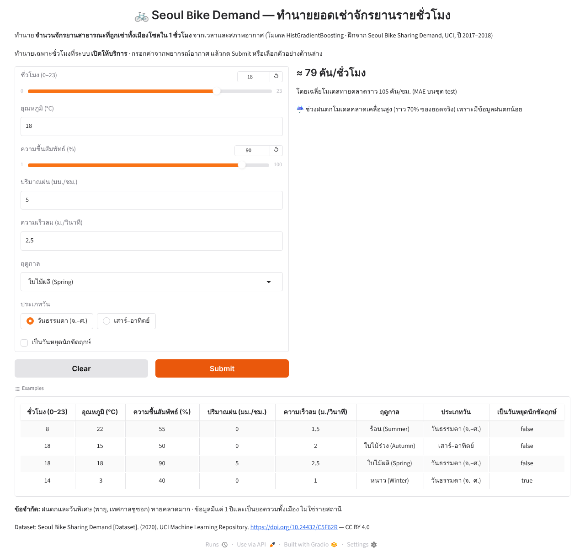

# Seoul Bike Demand App

> วิชา: **Introduction to Data Science** · กำหนดส่ง **15 ต.ค. 2569 07:00**

**bike-regression** — เว็บแอปทำนายจำนวนจักรยานสาธารณะที่ถูกเช่าในเมืองโซล (คัน/ชั่วโมง) จากเวลาและสภาพอากาศ

## 1. แนวคิด / ปัญหา / ประโยชน์

- **ปัญหา:** ระบบจักรยานสาธารณะต้องมีจักรยานพร้อมใช้ให้พอในแต่ละชั่วโมง ถ้าน้อยไป ผู้ใช้หาไม่เจอ ถ้ามากไป เสียค่าดูแลและพื้นที่ แต่ความต้องการขึ้นลงตามเวลาและอากาศมาก (ตี 4 ราว 120–180 คัน, 18:00 วันธรรมดาราว 1,800 คัน)
- **งาน:** Regression ทำนาย `Rented Bike Count` (คัน/ชั่วโมง ยอดรวมทั้งเมือง) จาก 8 ค่าที่รู้ล่วงหน้าได้จากพยากรณ์อากาศและปฏิทิน
- **ใครได้ประโยชน์ / ใช้อย่างไร:**
  - ผู้ให้บริการ: วางแผนจำนวนจักรยานและรอบรถขนย้ายจักรยานล่วงหน้า ในชั่วโมงที่คาดว่าความต้องการสูง
  - จัดตารางซ่อมบำรุงในชั่วโมงที่คาดว่ายอดต่ำ (กลางดึก, ฝนตก, ฤดูหนาว)
  - หน่วยงานเมือง: ประเมินผลของสภาพอากาศต่อการใช้จักรยาน

## 2. แหล่งข้อมูล จำนวน และการแบ่ง

| | |
|---|---|
| Dataset | Seoul Bike Sharing Demand — UCI ML Repository id 560 (CC BY 4.0) |
| ช่วงเวลา | 1 ธ.ค. 2017 – 30 พ.ย. 2018 · 1 แถว = 1 ชั่วโมง |
| จำนวนทั้งหมด | **8,760 แถว × 14 คอลัมน์** (365 วัน × 24 ชม.) · ไม่มี missing |
| train / test | **292 วัน (7,008 แถว) / 73 วัน (1,752 แถว)** = 80/20 แบ่งตาม **วัน** |
| หลังตัดแถวนอกขอบเขต | train 6,751 แถว · test 1,697 แถว (ตัดชั่วโมงที่ระบบปิด และความชื้น 0% ที่เป็นค่าผิดของเซนเซอร์) |

**ทำไมแบ่งตามวัน:** 1 วันมี 24 แถว และชั่วโมงติดกันมีอากาศและยอดเช่าใกล้กันมาก ถ้าสุ่มทีละแถว ชั่วโมง 8:00 อาจอยู่ train ส่วน 9:00 ของวันเดียวกันอยู่ test โมเดลจะ "จำวันนั้น" ได้ คะแนน test จะสูงเกินจริง (leakage) จึงใช้ `GroupShuffleSplit(test_size=0.2, random_state=42)` โดย group = วันที่ ทั้ง 24 ชั่วโมงของวันเดียวกันอยู่ฝั่งเดียวกันเสมอ และใช้ `GroupKFold` แบบเดียวกันตอนเลือกโมเดล

รายการวันอยู่ใน `bike-regression/data/splits/` สร้างด้วย `scripts/make_bike_split.py` ซึ่งใช้ logic เดียวกับ repo [seoul-bike-demand](https://github.com/Sh080205/seoul-bike-demand) และได้ไฟล์ตรงกันทุก byte

## 3. โมเดล ผลหลัก และข้อจำกัด

**Input ของแอป 8 ตัว:** ชั่วโมง, อุณหภูมิ, ความชื้น, ปริมาณฝน, ความเร็วลม, ฤดู, วันธรรมดา/เสาร์-อาทิตย์, วันหยุดนักขัตฤกษ์
ไม่ใช้ dew point / solar radiation / visibility / snowfall เพราะผู้ใช้ทั่วไปไม่รู้ค่า หรือซ้ำกับตัวอื่น (dew point corr กับอุณหภูมิ 0.91) · วัดแล้วการตัด 4 ตัวนี้ทำให้ CV MAE แย่ลงแค่ ~3 คัน/ชม.

**เลือกโมเดลด้วย 5-fold `GroupKFold` (group = วัน) บน train:**

| โมเดล | CV MAE (คัน/ชม.) | CV R² |
|---|---|---|
| Baseline: ค่าเฉลี่ยตาม ชั่วโมง × ประเภทวัน | 402.8 | 0.351 |
| Ridge (one-hot ชั่วโมง/ฤดู) | 287.4 | 0.656 |
| Random Forest | 130.7 | 0.891 |
| HistGradientBoosting (default) | 124.6 | 0.904 |
| **HistGradientBoosting (tuned, poisson loss)** ✅ | **120.1 ± 9.7** | **0.909** |

**ผลบน test (ประเมินครั้งเดียว):** **MAE 104.5 คัน/ชม.** · RMSE 171.2 · **R² 0.918**
ยอดเช่าเฉลี่ยใน test 619 คัน/ชม. → ทายคลาดเฉลี่ยราว 17% · test ดีกว่า CV เพราะ test มีวันฤดูหนาว (ยอดต่ำ) มากกว่า จึงควรใช้ CV ≈ 120 เป็นตัวเลขคาดการณ์ทั่วไป

**เหตุผลที่เลือก:** แม่นที่สุดใน CV, จับความสัมพันธ์ไม่เป็นเส้นตรงได้ (ยอดลดลงเมื่อร้อนเกิน 30 °C, ชั่วโมงพีคต่างกันระหว่างวันทำงาน/วันหยุด), poisson loss เหมาะกับจำนวนนับและไม่ทำนายค่าติดลบ, ไฟล์โมเดลแค่ ~0.5 MB

**ข้อจำกัด**
- **ฝนตก** ทายคลาดราว 71% ของยอดจริง (ไม่ตก 16%) เพราะชั่วโมงฝนตกมีแค่ ~6% ของข้อมูล
- **วันพิเศษที่ feature ไม่รู้** เช่น พายุไต้ฝุ่น Soulik (23 ส.ค. 2018) และเทศกาลชูซอก (24 ก.ย. 2018) เป็นวันที่ผิดมากที่สุด
- ชั่วโมงพีค (8:00, 18:00) คลาดเป็นคันมากที่สุด · โดยรวมทายสูงกว่าจริงเล็กน้อย (bias ≈ −32 คัน/ชม.)
- ข้อมูลแค่ 1 ปี เป็นยอดรวมทั้งเมือง (ไม่ใช่รายสถานี) และทำนายเฉพาะชั่วโมงที่ระบบเปิดให้บริการ

รายละเอียดทั้งหมด: `bike-regression/notebook/bike_regression.ipynb`

## 4. ติดตั้งและรันบนเครื่อง

```bash
py -3.13 -m venv .venv
.venv\Scripts\activate          # Windows  (macOS/Linux: source .venv/bin/activate)
pip install -r requirements.txt

python scripts/download_seoulbike.py   # ตรวจ CSV ที่ commit ไว้ (ถ้าไม่มีจะดาวน์โหลดจาก UCI)
python scripts/make_bike_split.py      # สร้างรายการวัน train/test (commit ไว้แล้ว รันซ้ำได้ผลเดิม)

jupyter notebook bike-regression/notebook/bike_regression.ipynb   # วิเคราะห์ + train → app/model.joblib
python bike-regression/app/app.py                                  # เปิดแอปที่ http://127.0.0.1:7860
```

`model.joblib` commit ไว้แล้ว รันแอปได้ทันทีโดยไม่ต้องรัน notebook

## 5. วิธีใช้ + ตัวอย่าง input

1. กรอกชั่วโมง (0–23) และค่าจากพยากรณ์อากาศ: อุณหภูมิ (°C), ความชื้น (%), ปริมาณฝน (มม./ชม.), ความเร็วลม (ม./วินาที)
2. เลือกฤดู, ประเภทวัน (วันธรรมดา / เสาร์–อาทิตย์) และติ๊กถ้าเป็นวันหยุดนักขัตฤกษ์
3. กด **Submit** → ได้ยอดเช่าโดยประมาณ (คัน/ชั่วโมง) · หรือคลิกแถวในตาราง Examples
4. ค่าผิดช่วงจะขึ้นข้อความเตือน · ค่านอกช่วงข้อมูลที่ใช้ฝึกจะทำนายให้แต่มีคำเตือน

| ชั่วโมง | อุณหภูมิ | ความชื้น | ฝน | ลม | ฤดู | ประเภทวัน | วันหยุด | ผลทำนาย |
|---|---|---|---|---|---|---|---|---|
| 8 | 22 | 55 | 0 | 1.5 | Summer | วันธรรมดา | – | ≈ 2,236 คัน/ชม. |
| 18 | 15 | 50 | 0 | 2.0 | Autumn | เสาร์–อาทิตย์ | – | ≈ 1,555 คัน/ชม. |
| 18 | 18 | 90 | 5 | 2.5 | Spring | วันธรรมดา | – | ≈ 79 คัน/ชม. |
| 14 | −3 | 40 | 0 | 1.0 | Winter | วันธรรมดา | ✔ | ≈ 216 คัน/ชม. |



## 6. URL แอป

TODO: ใส่ URL หลัง deploy — `https://huggingface.co/spaces/<hf-username>/seoul-bike-demand`

วิธี deploy (Hugging Face Space):
```bash
pip install -r requirements.txt               # มี huggingface_hub มากับ gradio แล้ว
set HF_TOKEN=hf_xxx                           # Windows (macOS/Linux: export HF_TOKEN=hf_xxx) — token แบบ Write
python scripts/deploy_space.py --repo-id <hf-username>/seoul-bike-demand
```
สคริปต์สร้าง Space (SDK Gradio) และอัปโหลดทั้งโฟลเดอร์ `bike-regression/app/` (ใช้ `upload_folder` เพราะ `model.joblib` เป็น binary) · ค่า Space อยู่ใน frontmatter ของ `bike-regression/app/README.md`

## 7. โครงสร้างไฟล์

```
config.py                         ค่าคงที่ (seed, path, encoding, ชื่อคอลัมน์) สำหรับ scripts + notebook
requirements.txt                  สำหรับ notebook + scripts
scripts/download_seoulbike.py     ตรวจ/ดาวน์โหลด Seoul Bike CSV
scripts/make_bike_split.py        แบ่ง train/test ตามวัน (ตรงกับ seoul-bike-demand)
scripts/deploy_space.py           deploy แอปขึ้น Hugging Face Space
bike-regression/data/             SeoulBikeData.csv + splits/{train,test}_dates.csv
bike-regression/notebook/         notebook: ปัญหา → ข้อมูล → split → EDA → train → test → error analysis → save
bike-regression/app/              Gradio app (self-contained): app.py, model.joblib, requirements.txt, README.md (Space config)
docs/                             ภาพหน้าจอแอป
```

## 8. สมาชิก (เรียงตามรหัสนิสิต)

| รหัสนิสิต | ชื่อ-นามสกุล |
|---|---|
| TODO | TODO |
| TODO | TODO |
| TODO | TODO |
| TODO | TODO |
| TODO | TODO |

## Attribution

- **Seoul Bike Sharing Demand** [Dataset]. (2020). UCI Machine Learning Repository. https://doi.org/10.24432/C5F62R — [CC BY 4.0](https://creativecommons.org/licenses/by/4.0/)
